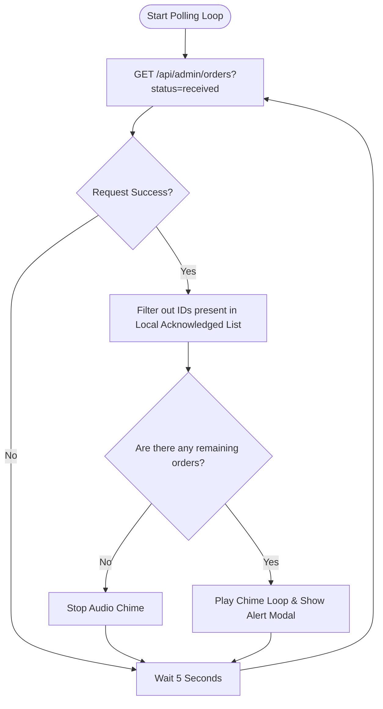

# Growlic Admin-Side API Documentation & Postman Testing Guide

This document lists the necessary REST APIs required to build your separate admin-side application (e.g. for ringing notifications and accepting orders), including the exact payloads, the step-by-step Postman testing process, and the template code to expose these endpoints when you are ready.

> [!NOTE]
> **No code changes have been applied to your repository.** 
> To test the order-fetching and order-accepting APIs, you can drop the two proposed Next.js API Route Handler templates (provided in Section 4) into your codebase. The login and database seeding APIs are already present in your project.

---

## 1. API Endpoints Reference

### A. Authentication
* **Method:** `POST`
* **URL:** `{{base_url}}/api/auth`
* **Headers:** `Content-Type: application/json`
* **Payload:**
```json
{
  "email": "owner@tokyomomos.com",
  "password": "Password123"
}
```
* **Success Response (HTTP 200):**
```json
{
  "success": true,
  "token": "eyJhbGciOiJIUzI1NiIsIn...",
  "restaurantId": "tokyo-momos",
  "restaurantName": "Tokyo Momos",
  "email": "owner@tokyomomos.com",
  "role": "owner"
}
```

### B. Fetch/Poll Incoming Orders
* **Method:** `GET`
* **URL:** `{{base_url}}/api/admin/orders?status=received&limit=20`
* **Headers:** 
  * `Authorization: Bearer {{jwt_token}}`
* **Success Response (HTTP 200):**
```json
{
  "success": true,
  "orders": [
    {
      "_id": "6682fa08f1b2c4c8d5d90123",
      "restaurantId": "tokyo-momos",
      "customerName": "Jane Doe",
      "customerPhone": "+919876543210",
      "tableId": "T-3",
      "items": [
        {
          "menuItemId": "momo-001",
          "name": "Steamed Veg Momo",
          "price": 120,
          "quantity": 2,
          "image": "/images/veg-momo.jpg"
        }
      ],
      "subtotal": 240,
      "total": 240,
      "status": "received",
      "estimatedTime": 0,
      "createdAt": "2026-07-01T13:42:00.000Z",
      "updatedAt": "2026-07-01T13:42:00.000Z"
    }
  ],
  "totalCount": 1
}
```

### C. Accept Order (Set ETA)
* **Method:** `PATCH`
* **URL:** `{{base_url}}/api/admin/orders/{{order_id}}`
* **Headers:** 
  * `Authorization: Bearer {{jwt_token}}`
  * `Content-Type: application/json`
* **Payload:**
```json
{
  "estimatedTime": 20
}
```
* **Success Response (HTTP 200):**
```json
{
  "success": true,
  "order": {
    "_id": "6682fa08f1b2c4c8d5d90123",
    "restaurantId": "tokyo-momos",
    "status": "accepted",
    "estimatedTime": 20,
    "createdAt": "2026-07-01T13:42:00.000Z",
    "updatedAt": "2026-07-01T13:46:10.000Z"
  }
}
```

### D. Reject/Cancel Order
* **Method:** `PATCH`
* **URL:** `{{base_url}}/api/admin/orders/{{order_id}}`
* **Headers:** 
  * `Authorization: Bearer {{jwt_token}}`
  * `Content-Type: application/json`
* **Payload:**
```json
{
  "status": "cancelled"
}
```
* **Success Response (HTTP 200):**
```json
{
  "success": true,
  "order": {
    "_id": "6682fa08f1b2c4c8d5d90123",
    "restaurantId": "tokyo-momos",
    "status": "cancelled",
    "estimatedTime": 0,
    "createdAt": "2026-07-01T13:42:00.000Z",
    "updatedAt": "2026-07-01T13:46:15.000Z"
  }
}
```

### E. Trigger Staff Call (Customer Flow)
* **Method:** `POST`
* **URL:** `{{base_url}}/api/customer/staff-calls`
* **Headers:** `Content-Type: application/json`
* **Payload:**
```json
{
  "restaurantId": "tokyo-momos",
  "tableId": "T-3"
}
```
* **Success Response (HTTP 200):**
```json
{
  "success": true,
  "call": {
    "_id": "6685f0b8f1b2c4c8d5d90999",
    "restaurantId": "tokyo-momos",
    "tableId": "T-3",
    "status": "pending",
    "createdAt": "2026-07-03T10:15:00.000Z",
    "updatedAt": "2026-07-03T10:15:00.000Z"
  }
}
```

### F. Fetch Pending Staff Calls (Admin Poll)
* **Method:** `GET`
* **URL:** `{{base_url}}/api/admin/staff-calls`
* **Headers:** 
  * `Authorization: Bearer {{jwt_token}}`
* **Success Response (HTTP 200):**
```json
{
  "success": true,
  "calls": [
    {
      "_id": "6685f0b8f1b2c4c8d5d90999",
      "restaurantId": "tokyo-momos",
      "tableId": "T-3",
      "status": "pending",
      "createdAt": "2026-07-03T10:15:00.000Z"
    }
  ]
}
```

### G. Accept/Resolve Staff Call (Admin Action)
* **Method:** `PATCH`
* **URL:** `{{base_url}}/api/admin/staff-calls/{{call_id}}`
* **Headers:** 
  * `Authorization: Bearer {{jwt_token}}`
  * `Content-Type: application/json`
* **Payload:**
```json
{
  "status": "accepted"
}
```
* **Success Response (HTTP 200):**
```json
{
  "success": true,
  "call": {
    "_id": "6685f0b8f1b2c4c8d5d90999",
    "restaurantId": "tokyo-momos",
    "tableId": "T-3",
    "status": "accepted",
    "createdAt": "2026-07-03T10:15:00.000Z",
    "updatedAt": "2026-07-03T10:16:10.000Z"
  }
}
```

---

## 2. Postman Testing Process: Step-by-Step

Follow these steps to test this integration end-to-end:

### Step 1: Start Your Local Development Server
Make sure your Growlic server is running locally (usually at `http://localhost:3000`).
Set a Postman environment variable `base_url` to `http://localhost:3000`.

### Step 2: Seed the Database (Optional but Recommended)
Send a request to clean transactional data and insert default configurations:
* **Request:** `GET {{base_url}}/api/seed`
* **Response:** `{ "message": "Database seeded successfully!", ... }`

### Step 3: Login to Obtain the JWT Token
1. Send the `POST {{base_url}}/api/auth` request using the seeded owner credentials:
   ```json
   {
     "email": "owner@tokyomomos.com",
     "password": "Password123"
   }
   ```
2. Copy the returned `"token"` string.
3. In Postman, you can add this token to your collection's **Variables** as `jwt_token`, or go to the **Authorization** tab of your requests, select **Bearer Token**, and paste the token there.

### Step 4: Place a Mock Order (Customer Flow)
To simulate a new order coming into the kitchen:
1. Open your browser and navigate to the customer menu page (e.g., `http://localhost:3000/tokyo-momos`).
2. Add an item to your cart.
3. Complete the checkout form (enter a name and phone number).
4. Place the order. 
*This will create a new order document in your MongoDB database with `status: "received"`.*

### Step 5: Poll for the Incoming Order (Simulate Ringing check)
1. Send the `GET {{base_url}}/api/admin/orders?status=received` request in Postman.
2. Verify that the order you placed in **Step 4** appears in the response array.
3. *In your separate app, if this array length is > 0, you would trigger the loop sound (ring) to alert the user.*
4. Copy the `_id` of the order from the response.

### Step 6: Accept the Order (Kitchen Action)
1. Configure a `PATCH {{base_url}}/api/admin/orders/{{order_id}}` request, replacing `{{order_id}}` with the `_id` you copied.
2. In the body, send `{"estimatedTime": 25}`.
3. Send the request.
4. Verify that:
   * The response shows `"success": true`.
   * The returned order's `"status"` has changed to `"accepted"`.
   * The `"estimatedTime"` is updated to `25`.
5. Send the polling request from **Step 5** again; the order should no longer appear since it is no longer in `received` status (which stops the ringing on the client).

---

## 3. Client-Side Ringing Algorithm Details

When writing your separate mobile/admin app, implement the following local loop:



* **Preventing Repeat Rings:** Keep a persistent list in local storage (`AsyncStorage` on mobile) of acknowledged IDs. Whenever the admin rejects or accepts an order, or dismisses the popup manually, immediately add that order's ID to this list. This silences the ring instantly on the client side before the next poll.

---

## 4. REST API Route Code Templates

Whenever you are ready to activate these REST routes in your codebase, you can create the following two files:

### Route 1: `src/app/api/admin/orders/route.ts`
This file handles listing and filtering orders by status:
```typescript
import { NextRequest, NextResponse } from 'next/server';
import { verifyToken } from '@/lib/auth';
import { can } from '@/features/auth';
import * as orderService from '@/features/order';
import { handleRouteError, AuthenticationError } from '@/shared/errors';

function getAuthDetails(req: NextRequest) {
  let token = req.cookies.get('admin_token')?.value;
  if (!token) {
    const authHeader = req.headers.get('authorization');
    if (authHeader && authHeader.startsWith('Bearer ')) {
      token = authHeader.substring(7);
    }
  }
  if (!token) return null;
  const decoded = verifyToken(token);
  if (!decoded) return null;
  return { ...decoded, token };
}

export async function GET(req: NextRequest) {
  try {
    const auth = getAuthDetails(req);
    if (!auth) {
      throw new AuthenticationError('Unauthorized access');
    }

    const isAllowed = (await can('manage_orders', auth.token, auth.restaurantId)) ||
                      (await can('update_order_status', auth.token, auth.restaurantId));
    if (!isAllowed) {
      return NextResponse.json({ error: 'Forbidden: Insufficient permissions' }, { status: 403 });
    }

    const { searchParams } = new URL(req.url);
    const status = searchParams.get('status') || undefined;
    const limit = parseInt(searchParams.get('limit') || '50', 10);
    const skip = parseInt(searchParams.get('skip') || '0', 10);

    const result = await orderService.getAdminOrders(auth.restaurantId, limit, skip, status);
    return NextResponse.json({
      success: true,
      orders: result.orders,
      totalCount: result.totalCount,
    });
  } catch (error) {
    return handleRouteError(error);
  }
}
```

### Route 2: `src/app/api/admin/orders/[id]/route.ts`
This file handles order status changes and ETAs:
```typescript
import { NextRequest, NextResponse } from 'next/server';
import { verifyToken } from '@/lib/auth';
import { can } from '@/features/auth';
import * as orderService from '@/features/order';
import { logAction } from '@/features/audit';
import { getAdminByRestaurantId } from '@/features/auth';
import { handleRouteError, AuthenticationError, ValidationError } from '@/shared/errors';

function getAuthDetails(req: NextRequest) {
  let token = req.cookies.get('admin_token')?.value;
  if (!token) {
    const authHeader = req.headers.get('authorization');
    if (authHeader && authHeader.startsWith('Bearer ')) {
      token = authHeader.substring(7);
    }
  }
  if (!token) return null;
  const decoded = verifyToken(token);
  if (!decoded) return null;
  return { ...decoded, token };
}

export async function PATCH(
  req: NextRequest,
  { params }: { params: Promise<{ id: string }> }
) {
  try {
    const auth = getAuthDetails(req);
    if (!auth) {
      throw new AuthenticationError('Unauthorized access');
    }

    const { id } = await params;
    const body = await req.json();
    const { status, estimatedTime } = body;

    const isAllowed = await can('update_order_status', auth.token, auth.restaurantId);
    if (!isAllowed) {
      return NextResponse.json({ error: 'Forbidden: Insufficient permissions' }, { status: 403 });
    }

    const adminUser = await getAdminByRestaurantId(auth.restaurantId);
    if (!adminUser) {
      throw new Error('Admin account not found');
    }

    const existing = await orderService.getOrderById(id, auth.restaurantId);
    if (!existing) {
      return NextResponse.json({ error: 'Order not found or unauthorized' }, { status: 404 });
    }

    let updatedOrder;

    if (typeof estimatedTime === 'number') {
      updatedOrder = await orderService.updateOrderEstimatedTime(id, auth.restaurantId, estimatedTime);
      await logAction(auth.restaurantId, adminUser._id, 'ORDER_STATUS_CHANGED', existing, updatedOrder);
    } else if (status) {
      updatedOrder = await orderService.updateOrderStatus(id, auth.restaurantId, status);
      await logAction(auth.restaurantId, adminUser._id, 'ORDER_STATUS_CHANGED', existing, updatedOrder);
    } else {
      throw new ValidationError('Either status or estimatedTime must be provided');
    }

    return NextResponse.json({
      success: true,
      order: updatedOrder,
    });
  } catch (error) {
    return handleRouteError(error);
  }
}
```

### Route 3: `src/app/api/admin/staff-calls/route.ts`
Exposes the pending staff calls check to the admin application:
```typescript
import { NextRequest, NextResponse } from 'next/server';
import { verifyToken } from '@/lib/auth';
import { can } from '@/features/auth';
import * as orderService from '@/features/order';
import { handleRouteError, AuthenticationError } from '@/shared/errors';

function getAuthDetails(req: NextRequest) {
  let token = req.cookies.get('admin_token')?.value;
  if (!token) {
    const authHeader = req.headers.get('authorization');
    if (authHeader && authHeader.startsWith('Bearer ')) {
      token = authHeader.substring(7);
    }
  }
  if (!token) return null;
  const decoded = verifyToken(token);
  if (!decoded) return null;
  return { ...decoded, token };
}

export async function GET(req: NextRequest) {
  try {
    const auth = getAuthDetails(req);
    if (!auth) {
      throw new AuthenticationError('Unauthorized access');
    }

    const isAllowed = (await can('manage_orders', auth.token, auth.restaurantId)) ||
                      (await can('update_order_status', auth.token, auth.restaurantId));
    if (!isAllowed) {
      return NextResponse.json({ error: 'Forbidden: Insufficient permissions' }, { status: 403 });
    }

    const result = await orderService.getPendingStaffCalls(auth.restaurantId);
    return NextResponse.json({
      success: true,
      calls: result,
    });
  } catch (error) {
    return handleRouteError(error);
  }
}
```

### Route 4: `src/app/api/admin/staff-calls/[id]/route.ts`
Allows the admin application to resolve (accept/reject) a staff call:
```typescript
import { NextRequest, NextResponse } from 'next/server';
import { verifyToken } from '@/lib/auth';
import { can } from '@/features/auth';
import * as orderService from '@/features/order';
import { handleRouteError, AuthenticationError, ValidationError } from '@/shared/errors';

function getAuthDetails(req: NextRequest) {
  let token = req.cookies.get('admin_token')?.value;
  if (!token) {
    const authHeader = req.headers.get('authorization');
    if (authHeader && authHeader.startsWith('Bearer ')) {
      token = authHeader.substring(7);
    }
  }
  if (!token) return null;
  const decoded = verifyToken(token);
  if (!decoded) return null;
  return { ...decoded, token };
}

export async function PATCH(
  req: NextRequest,
  { params }: { params: Promise<{ id: string }> }
) {
  try {
    const auth = getAuthDetails(req);
    if (!auth) {
      throw new AuthenticationError('Unauthorized access');
    }

    const { id } = await params;
    const body = await req.json();
    const { status } = body;

    if (status !== 'accepted' && status !== 'rejected') {
      throw new ValidationError('Status must be accepted or rejected');
    }

    const isAllowed = await can('update_order_status', auth.token, auth.restaurantId);
    if (!isAllowed) {
      return NextResponse.json({ error: 'Forbidden: Insufficient permissions' }, { status: 403 });
    }

    const updatedCall = await orderService.updateStaffCallStatus(id, status);
    return NextResponse.json({
      success: true,
      call: updatedCall,
    });
  } catch (error) {
    return handleRouteError(error);
  }
}
```

### Route 5: `src/app/api/customer/staff-calls/route.ts`
Exposes table staff calls trigger endpoint to the customer:
```typescript
import { NextRequest, NextResponse } from 'next/server';
import * as orderService from '@/features/order';
import { handleRouteError, ValidationError } from '@/shared/errors';

export async function POST(req: NextRequest) {
  try {
    const body = await req.json();
    const { restaurantId, tableId } = body;

    if (!restaurantId || !tableId) {
      throw new ValidationError('restaurantId and tableId are required');
    }

    const result = await orderService.createStaffCall(restaurantId, tableId);
    return NextResponse.json({
      success: true,
      call: result,
    });
  } catch (error) {
    return handleRouteError(error);
  }
}
```
