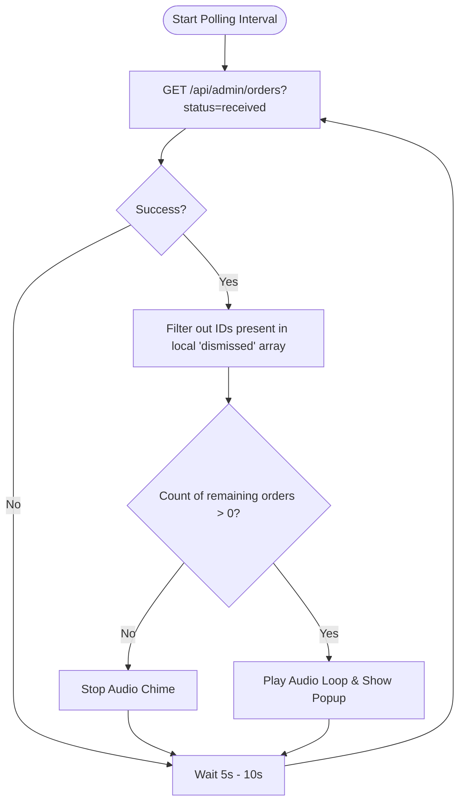

# Growlic Admin App Integration Guide: Ringing & Order Acceptance

This document provides the exact specifications of the core REST APIs required to build your separate admin-side application (e.g., mobile or desktop app) that triggers audio alerts (ringing) when a new order is received, and allows the admin to accept or cancel the order.

> [!NOTE]
> **No changes have been made to your codebase.** 
> To test the order-polling and order-accepting REST APIs, you can drop the two proposed Next.js API Route templates (provided in Section 4) into your codebase. The login (`/api/auth`) and database seeding (`/api/seed`) REST endpoints are already active in your project.

---

## 1. The Core APIs (Ringing & Acceptance)

### A. Admin Authentication
Before calling any admin-restricted endpoints, your separate app must login to obtain a JSON Web Token (JWT).
* **Method:** `POST`
* **URL:** `{{base_url}}/api/auth`
* **Headers:** `Content-Type: application/json`
* **Body:**
```json
{
  "email": "owner@tokyomomos.com",
  "password": "Password123"
}
```
* **Response (Success - HTTP 200):**
```json
{
  "success": true,
  "token": "eyJhbGciOiJIUzI1NiIsInR5cCI6IkpXVCJ9...",
  "restaurantId": "tokyo-momos",
  "restaurantName": "Tokyo Momos",
  "email": "owner@tokyomomos.com",
  "role": "owner"
}
```
*   **Action for App:** Store the `"token"` and `"restaurantId"` locally. Pass the token as a Bearer token in the `Authorization` header for all subsequent calls.

---

### B. Poll Incoming Orders (Trigger Ringing)
To trigger the phone ringing, the app must continuously or periodically poll for incoming orders that have a status of `"received"`.
* **Method:** `GET`
* **URL:** `{{base_url}}/api/admin/orders?status=received&limit=20`
* **Headers:** 
  * `Authorization: Bearer {{jwt_token}}`
* **Response (Success - HTTP 200):**
```json
{
  "success": true,
  "orders": [
    {
      "_id": "6682fa08f1b2c4c8d5d90123",
      "restaurantId": "tokyo-momos",
      "customerName": "Jane Doe",
      "customerPhone": "+919876543210",
      "tableId": "T-3",
      "items": [
        {
          "menuItemId": "momo-001",
          "name": "Steamed Veg Momo",
          "price": 120,
          "quantity": 2,
          "image": "/images/veg-momo.jpg"
        }
      ],
      "subtotal": 240,
      "total": 240,
      "status": "received",
      "estimatedTime": 0,
      "createdAt": "2026-07-01T13:42:00.000Z",
      "updatedAt": "2026-07-01T13:42:00.000Z"
    }
  ],
  "totalCount": 1
}
```
*   **Action for App:** 
    *   If the returned `orders` list contains at least one item, trigger the phone loop sound (alarm/ring).
    *   If the list is empty, stop the ringing sound.

---

### C. Accept Order (Set ETA & Stop Ringing)
When the admin accepts an order, they set a preparation ETA in minutes. Setting an ETA changes the status of the order to `"accepted"`.
* **Method:** `PATCH`
* **URL:** `{{base_url}}/api/admin/orders/{{order_id}}`
* **Headers:** 
  * `Authorization: Bearer {{jwt_token}}`
  * `Content-Type: application/json`
* **Body:**
```json
{
  "estimatedTime": 25
}
```
* **Response (Success - HTTP 200):**
```json
{
  "success": true,
  "order": {
    "_id": "6682fa08f1b2c4c8d5d90123",
    "restaurantId": "tokyo-momos",
    "status": "accepted",
    "estimatedTime": 25,
    "createdAt": "2026-07-01T13:42:00.000Z",
    "updatedAt": "2026-07-01T13:46:10.000Z"
  }
}
```
*   **Action for App:** Stop the ringing sound and update the local UI list. Because the status is now `"accepted"`, it will automatically disappear from the next `GET /api/admin/orders?status=received` poll request.

---

### D. Reject / Cancel Order
If the admin cannot fulfill the order, they can cancel/reject it.
* **Method:** `PATCH`
* **URL:** `{{base_url}}/api/admin/orders/{{order_id}}`
* **Headers:** 
  * `Authorization: Bearer {{jwt_token}}`
  * `Content-Type: application/json`
* **Body:**
```json
{
  "status": "cancelled"
}
```
* **Response (Success - HTTP 200):**
```json
{
  "success": true,
  "order": {
    "_id": "6682fa08f1b2c4c8d5d90123",
    "restaurantId": "tokyo-momos",
    "status": "cancelled",
    "estimatedTime": 0,
    "createdAt": "2026-07-01T13:42:00.000Z",
    "updatedAt": "2026-07-01T13:46:15.000Z"
  }
}
```
*   **Action for App:** Stop the ringing sound and remove it from the screen.

---

## 2. Postman Testing Workflow

Use the following step-by-step procedure to test the ringing and acceptance flow in Postman:

### Step 1: Start your backend server
Verify your local Growlic development server is running (usually at `http://localhost:3000`). Create a Postman Environment containing a `base_url` variable set to `http://localhost:3000`.

### Step 2: Seed the Database
Send a `GET` request to clear transactional logs and seed test data.
*   **Request:** `GET {{base_url}}/api/seed`
*   **Response:** Expect `200 OK` with seed metrics.

### Step 3: Login to obtain the JWT token
Send a `POST` request to `/api/auth` with the credentials of the seeded owner:
*   **Request:** `POST {{base_url}}/api/auth`
*   **Payload:**
    ```json
    {
      "email": "owner@tokyomomos.com",
      "password": "Password123"
    }
    ```
*   **Action:** Copy the returned `token` from the response. Go to your Postman Collection variables and save it as `jwt_token`. Configure your subsequent admin requests to use `Bearer Token` auth referencing `{{jwt_token}}`.

### Step 4: Simulate a Customer placing an order
1. Go to your browser and open `http://localhost:3000/tokyo-momos`.
2. Add items to your cart, click **Checkout**, enter details, and submit.
3. This creates a new order in the database with `"status": "received"`.

### Step 5: Poll for received orders (Verify Ringing trigger)
Send a `GET` request to retrieve all received orders:
*   **Request:** `GET {{base_url}}/api/admin/orders?status=received`
*   **Headers:** `Authorization: Bearer {{jwt_token}}`
*   **Verify:** You should see your newly placed order in the `orders` array.
*   **Postman/App Test:** If `orders.length > 0`, play the audio ring loop. Copy the `_id` of the order.

### Step 6: Accept the order (Verify Acceptance & Stop Ringing)
Send a `PATCH` request to accept the order and set an ETA:
*   **Request:** `PATCH {{base_url}}/api/admin/orders/{{order_id}}` (Replace `{{order_id}}` with the `_id` you copied)
*   **Headers:** 
    *   `Authorization: Bearer {{jwt_token}}`
    *   `Content-Type: application/json`
*   **Payload:**
    ```json
    {
      "estimatedTime": 20
    }
    ```
*   **Verify:** The response shows `status: "accepted"`. 
*   **Poll Again:** Resend the request from **Step 5** (`GET /api/admin/orders?status=received`). The order should no longer appear, signifying that the ringing will stop.

---

## 3. Client-Side Ringing Algorithm

To implement the ringing loop on the separate admin app, use the following logic pattern:



> [!TIP]
> **Audio Persistence Note:** 
> Keep an array of locally dismissed/acknowledged order IDs in the app's state. When the admin manually taps "Dismiss Alert" or accepts the order, add the order `_id` to the local array. This will immediately stop the sound without waiting for the next polling request to return from the network.

---

## 4. Exposed REST API Templates

Since the default codebase uses Next.js Server Actions for internal frontend updates, you need to create these two files in your project to expose the REST API endpoints needed for your external app:

### Route 1: `src/app/api/admin/orders/route.ts`
*Handles listing received orders.*
```typescript
import { NextRequest, NextResponse } from 'next/server';
import { verifyToken } from '@/lib/auth';
import { can } from '@/features/auth';
import * as orderService from '@/features/order';
import { handleRouteError, AuthenticationError } from '@/shared/errors';

function getAuthDetails(req: NextRequest) {
  let token = req.cookies.get('admin_token')?.value;
  if (!token) {
    const authHeader = req.headers.get('authorization');
    if (authHeader && authHeader.startsWith('Bearer ')) {
      token = authHeader.substring(7);
    }
  }
  if (!token) return null;
  const decoded = verifyToken(token);
  if (!decoded) return null;
  return { ...decoded, token };
}

export async function GET(req: NextRequest) {
  try {
    const auth = getAuthDetails(req);
    if (!auth) {
      throw new AuthenticationError('Unauthorized access');
    }

    const isAllowed = (await can('manage_orders', auth.token, auth.restaurantId)) ||
                      (await can('update_order_status', auth.token, auth.restaurantId));
    if (!isAllowed) {
      return NextResponse.json({ error: 'Forbidden: Insufficient permissions' }, { status: 403 });
    }

    const { searchParams } = new URL(req.url);
    const status = searchParams.get('status') || undefined;
    const limit = parseInt(searchParams.get('limit') || '50', 10);
    const skip = parseInt(searchParams.get('skip') || '0', 10);

    const result = await orderService.getAdminOrders(auth.restaurantId, limit, skip, status);
    return NextResponse.json({
      success: true,
      orders: result.orders,
      totalCount: result.totalCount,
    });
  } catch (error) {
    return handleRouteError(error);
  }
}
```

### Route 2: `src/app/api/admin/orders/[id]/route.ts`
*Handles updating order status or setting preparation minutes.*
```typescript
import { NextRequest, NextResponse } from 'next/server';
import { verifyToken } from '@/lib/auth';
import { can } from '@/features/auth';
import * as orderService from '@/features/order';
import { logAction } from '@/features/audit';
import { getAdminByRestaurantId } from '@/features/auth';
import { handleRouteError, AuthenticationError, ValidationError } from '@/shared/errors';

function getAuthDetails(req: NextRequest) {
  let token = req.cookies.get('admin_token')?.value;
  if (!token) {
    const authHeader = req.headers.get('authorization');
    if (authHeader && authHeader.startsWith('Bearer ')) {
      token = authHeader.substring(7);
    }
  }
  if (!token) return null;
  const decoded = verifyToken(token);
  if (!decoded) return null;
  return { ...decoded, token };
}

export async function PATCH(
  req: NextRequest,
  { params }: { params: Promise<{ id: string }> }
) {
  try {
    const auth = getAuthDetails(req);
    if (!auth) {
      throw new AuthenticationError('Unauthorized access');
    }

    const { id } = await params;
    const body = await req.json();
    const { status, estimatedTime } = body;

    const isAllowed = await can('update_order_status', auth.token, auth.restaurantId);
    if (!isAllowed) {
      return NextResponse.json({ error: 'Forbidden: Insufficient permissions' }, { status: 403 });
    }

    const adminUser = await getAdminByRestaurantId(auth.restaurantId);
    if (!adminUser) {
      throw new Error('Admin account not found');
    }

    const existing = await orderService.getOrderById(id, auth.restaurantId);
    if (!existing) {
      return NextResponse.json({ error: 'Order not found or unauthorized' }, { status: 404 });
    }

    let updatedOrder;

    if (typeof estimatedTime === 'number') {
      updatedOrder = await orderService.updateOrderEstimatedTime(id, auth.restaurantId, estimatedTime);
      await logAction(auth.restaurantId, adminUser._id, 'ORDER_STATUS_CHANGED', existing, updatedOrder);
    } else if (status) {
      updatedOrder = await orderService.updateOrderStatus(id, auth.restaurantId, status);
      await logAction(auth.restaurantId, adminUser._id, 'ORDER_STATUS_CHANGED', existing, updatedOrder);
    } else {
      throw new ValidationError('Either status or estimatedTime must be provided');
    }

    return NextResponse.json({
      success: true,
      order: updatedOrder,
    });
  } catch (error) {
    return handleRouteError(error);
  }
}
```
