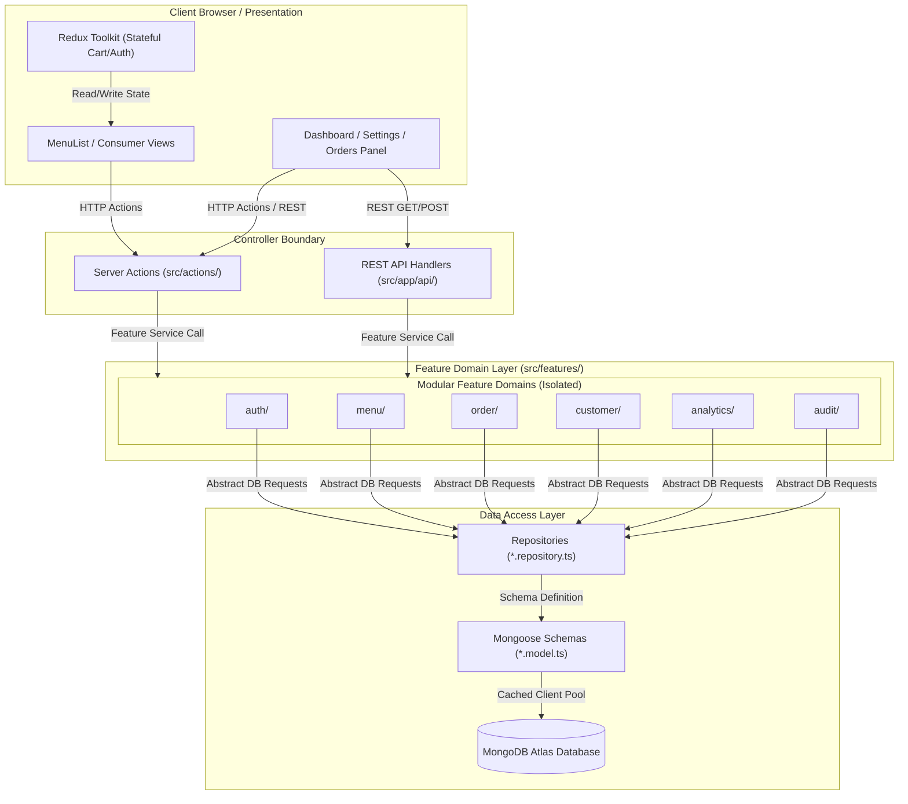

# System Architecture & Folder Directory Guide

This document outlines the architectural patterns, folder structure, layer communication protocols, and system design patterns governing the Growlic platform.

---

## 1. High-Level Modular Monolith Diagram

---

## 2. Directory Structure and Architectural Purpose

Below is the directory mapping of the Growlic codebase:

### Root Folders

*   `public/`: Houses static resources (icons, brand marks, placeholder media) rendered directly by the web server.
*   `src/`: Primary codebase container enclosing all business components, controllers, and domain layers.

### Source Core Folders (`src/`)

*   `src/app/`: Handles Next.js routing. It contains layouts, page initializers, REST route handlers, and CSS configs.
    *   `src/app/admin/`: Admin panels (Menu config, Settings, Orders list, Analytics reports).
    *   `src/app/api/`: REST API paths (e.g. login endpoints, register, seeders, super-admin).
    *   `src/app/menu/`: Dynamic client-facing web views mapped to table QR-code parameters.
*   `src/actions/`: Entry controllers for Next.js Server Actions. They check cookies (`admin_token`), validate sessions in the database, verify permissions (`can('permission')`), parse payload sizes, and call services.
*   `src/components/`: Stateless, generic reusable blocks.
    *   `src/components/ui/`: Primitive components (e.g. `AdminButton`, `StatusBadge`). These must have zero business rules or database references.
    *   `src/components/layout/`: Structural shells (e.g. `Sidebar`, `CustomerNavbar`).
    *   `src/components/providers/`: Root wrappers (e.g. Redux providers, toast contexts).
*   `src/features/`: Contains modular business features (domains). Each folder is an isolated vertical module containing:
    *   `model.ts`: Schemas, index configurations, and model compilation.
    *   `repository.ts`: Direct MongoDB database queries. Serializes BSON records into plain TypeScript interfaces.
    *   `service.ts`: Enforces core business logic and workflows.
    *   `validation.ts`: Checks parameter formats before DB operations.
    *   `calculations.ts`: State-free mathematical helper functions.
    *   `types.ts`: Local type declarations.
    *   `index.ts`: Public barrel file. Only properties exported here are accessible outside the feature.
*   `src/lib/`: Instantiates shared utilities (e.g., Mongoose cache pool in `mongodb.ts` and JWT verification wrappers in `auth.ts`).
*   `src/redux/`: Global client-side store configuration (`store.ts`, `cartSlice.ts`).
*   `src/shared/`: Application-wide resources (e.g., error models in `errors.ts` and database seeding scripts in `seedService.ts`).

---

## 3. Communication Protocols Between Layers

To prevent architectural decay, Growlic enforces strict unidirectional communication boundaries:

1.  **UI to Controllers**: React pages and client components communicate with the server exclusively via Next.js Server Actions (`src/actions/*`) or REST API routes (`src/app/api/*`).
2.  **Controllers to Features**: Server Actions and API Route Handlers invoke feature services by importing strictly from the public index entry point (`@/features/<feature_name>`). Deep imports (e.g. importing `@/features/menu/model`) are blocked by compile-time ESLint rules.
3.  **Services to Repositories**: Business logic services process validations and mathematical steps, then pass data tasks to repositories (`repository.ts`). Services never import Mongoose or interact with the database directly.
4.  **Repositories to Schemas**: Repositories query the Mongoose models, fetch BSON documents, and normalize them into plain, serializable TypeScript objects. No raw Mongoose documents leak outside the repository.
5.  **Multi-Tenant Boundaries**: Every repository query dynamically filters by the tenant's `restaurantId` (e.g., `{ restaurantId }`). Admin operations verify that the session tenant ID matches the query parameters.
