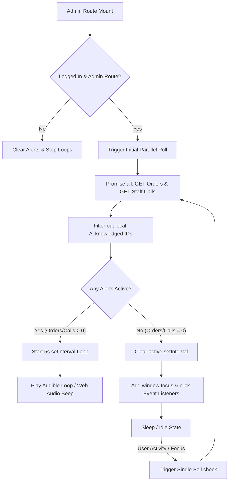
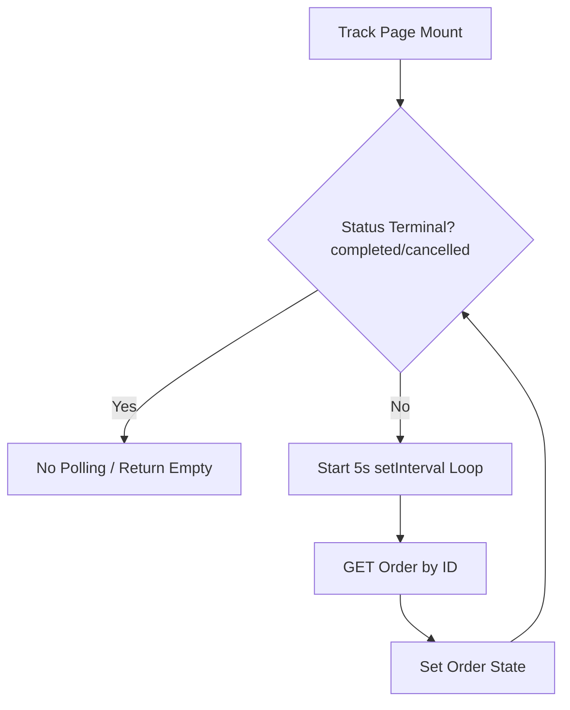

# Growlic Polling System Architecture & Scalability Report

This document provides a detailed technical analysis of the polling mechanism implemented in the Growlic codebase. It outlines how polling operates, the files involved, event handlers, lifecycle cleanups, and offers an evaluation of the system's pros, cons, and future scaling capabilities.

---

## 1. Overview of Polling Mechanisms

Growlic utilizes HTTP polling in two distinct client-facing scopes to simulate real-time synchronization between the kitchen and customers without requiring a persistent socket gateway:
1. **Admin Order & Staff Call Alert Loop:** Mounted globally on the admin layout to trigger visual alarms and audible chimes for incoming orders and customer table calls.
2. **Customer Order Tracker Loop:** Mounted on the live tracking screen to update order statuses (Accepted ➔ Preparing ➔ Completed) and display the countdown timer.

---

## 2. Deep Dive: Component Flows & Lifecycles

### A. Admin Polling Loop
* **File Location:** `src/components/providers/OrderNotificationProvider.tsx` (Line 230 onwards)
* **Trigger Condition:** Executes when the following criteria are met:
  * `auth.isLoggedIn` is `true`.
  * `auth.restaurantId` is a truthy string.
  * The current route starts with `/admin` (`isAdminRoute = true`).



#### Polling Execution & Parallel Optimization
The loop runs the async helper `checkIncomingOrdersAndCalls`. To minimize database bottlenecks and serverless invocation times, it queries both database collections in parallel using `Promise.all`:
```typescript
const [ordersResult, staffCallsResult] = await Promise.all([
  getAdminOrders(50, 0, 'received'),
  getPendingStaffCallsAction(auth.restaurantId || ''),
]);
```
These actions trigger the database handlers `findAll` and `getPendingStaffCalls` in `src/features/order/repository.ts`.

#### Dynamic Backoff & Wake Up
* **Fast Polling (Active Alerts):** If there are unacknowledged orders or staff calls, the system activates a fast `setInterval` that polls every **5 seconds**.
* **Zero Overhead Idle (Zero Alerts):** If the alert queue becomes empty (all items accepted, rejected, or local-dismissed), the system clears the interval (`clearInterval` is called). The background polling rate drops to **0 requests**, avoiding redundant serverless function calls.
* **Activity Wake-Up:** Once idle, the provider attaches event listeners to `window` for `focus` and `click`. When the admin interacts with their device or switches back to the tab, the handler runs a single manual check. If a new alert is returned, the fast 5-second interval loop restarts automatically.

#### Lifecycle Cleanup
The `useEffect` polling block returns a cleanup function that triggers when:
* The user logs out.
* The admin navigates away from the `/admin` path (changing `isAdminRoute` to false).
* The component unmounts.

The cleanup routine strictly:
1. Clears any running `setInterval` pointer.
2. Removes the `focus` and `click` event listeners from `window` to prevent memory leaks.
3. Pauses and rewinds any active HTMLAudio chimes.

---

### B. Customer Order Tracker Loop
* **File Location:** `src/features/order/components/OrderTracker.tsx` (Line 46 onwards)
* **Trigger Condition:** Opens when a customer loads the `/track/[orderId]` page.



#### Auto-Termination & Short-Circuiting
The tracker page polls the single order details using a `setInterval` set to **5 seconds** via `getOrderById` in `src/actions/orders.ts`. 

Unlike the admin panel, the order tracker has a definite terminal state:
```typescript
if (order.status === 'completed' || order.status === 'cancelled') {
  return; // Auto-terminate polling hook
}
```
Once the chef marks the order as completed or cancelled, the polling hook short-circuits and never registers the interval, saving server resources on finished transactions.

#### Lifecycle Cleanup
When the customer navigates back to the menu or closes the tracker screen, the `useEffect` cleanup hook executes `clearInterval(interval)` instantly.

---

## 3. Evaluation & Rating

### Overall Rating: 8.5 / 10 (Excellent for HTTP Polling)

For an application built on standard HTTP polling (without a dedicated websocket gateway server), the implementation is highly optimized. It is designed defensively to protect against serverless and database overloads.

### What is Good (The Pros)
1. **Request Coalescing:** Using `Promise.all` in `OrderNotificationProvider` merges two distinct business alerts (Incoming Orders and Waiter Table Calls) into a single batch query cycle, cutting the total HTTP traffic in half.
2. **Zero-Overhead Idle Backoff:** Turning off the interval completely when there are no active alerts is an excellent optimization. A dashboard left open overnight will consume **zero** API requests and database operations.
3. **Autoplay-Safe Audio:** Browser security policies block raw `.play()` calls on audio elements if there has been no prior user interaction. The synthesiser fallback (`playSynthesizedBeep` using the browser's Web Audio API `AudioContext`) ensures the kitchen hears alert chimes even if browser audio policies throttle HTML5 audio.
4. **Short-Circuiting Terminal Tracker:** Stopping the customer tracker interval once status is `completed` or `cancelled` prevents stale clients from polling completed orders indefinitely.

---

## 4. Drawbacks & Scalability Limits

While highly optimized, HTTP polling has architectural limits that impact scaling:

1. **Serverless Invocation Spam (Concurrency Bottlenecks):**
   * *Problem:* Next.js Server Actions execute as Serverless Functions (e.g., Vercel Functions). If 10 restaurants have their admin dashboards open, and 100 customers are tracking orders, the system handles 110 requests every 5 seconds.
   * *Impact:* Under heavy traffic (e.g., peak lunch hours with hundreds of active tables), the concurrent connection count will spike, leading to database connection pool exhaustion (`Too many connections` MongoDB error) and higher serverless usage bills.
2. **Latency (Lack of Instant Response):**
   * *Problem:* Polling introduces an average latency of $2.5$ seconds (half of the poll interval) before an event is detected.
   * *Impact:* An admin might accept an order, but the customer won't see the state update on their screen for up to 5 seconds.
3. **HTTP Header Overhead:**
   * *Problem:* Every 5-second poll sends cookie data, user-agent details, and headers.
   * *Impact:* This consumes significant network bandwidth compared to lightweight web sockets.

---

## 5. Scalability Suggestions (Future Roadmap)

To scale Growlic to support hundreds of restaurants and thousands of concurrent tables, consider transitioning from polling to a push-based architecture:

```
[Phase 1: Current]  HTTP Polling (5s Interval, Idle Backoff)
       ➔
[Phase 2: Mid-Term] Server-Sent Events (SSE) (Uni-directional Push)
       ➔
[Phase 3: Long-Term] WebSockets / PubSub Gateway (Bi-directional Instant Push)
```

### A. Mid-Term Optimization: Server-Sent Events (SSE)
* **What:** Transition the Admin Alert and Order Tracker to read from an SSE stream.
* **Why:** SSE keeps a single, long-lived HTTP connection open. Instead of polling every 5 seconds, the server pushes updates instantly when the database changes. This reduces HTTP handshake overhead and lowers latency to milliseconds.
* **Implementation:** Create a Next.js Route Handler using `ReadableStream` that listens to MongoDB Change Streams (`Order.watch()`) and broadcasts changes.

### B. Long-Term Architecture: Decoupled PubSub Gateway (e.g., Supabase / WebSockets)
* **What:** Move real-time listeners away from Next.js serverless functions to a dedicated state gateway (like WebSockets, AWS IoT Core, or Supabase Realtime).
* **Why:** This offloads connection state management from Next.js, protecting database pools. When a customer calls staff, the event is published to a channel, and the Admin client receives it instantly via a lightweight websocket frame.
